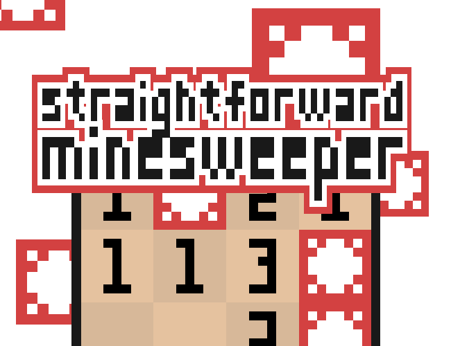

# Straightforward Minesweeper ([Itch.io](https://mondfuchs.itch.io/straightforwardminesweeper))

 

*A simple pixelated and animated minesweeper recreation made with Lua and LÖVE2D framework, with various customization settings. For instance: board width, board height, mine density and seed, besides simpler settings, like animations and volume.*

## How to Play:
The basic structure is the same as the original minesweeper. Click in a cell with the left mouse button to dig it, its number tells how many out of the eight cells surrounding it are mines. Use the right mouse button to put a flag on a mine cell to guarantee you won't dig it.
Once all free cells were clicked, you win the game. If you dig a mine, you lose. *You can also always press N to start a new game.*

## Options:
*(To access and to exit the options' menu, press E)*
- **Board width:** use the left-right arrows to increase or decrease the board's width.
- **Board height:** use the left-right arrows to increase or decrease the board's height.
- **Seed:** this value is used as a parameter on the "randomseed()" Lua's function. Instead of increasing and decreasing it with the arrows, here you type it. If no seed is set, the game will automatically generate a new one.
- **Mine density:** How many percent of the cells are mines, from 0 (no mines at all) to 100 (full of mines). As the seed, you type this value.
- **Volume:** use the left-right arrows to increase or decrease the game's volume.
- **Animations:** use the left-right arrows to set the animations to 0 (animations false) or 1 (animations true).

*Every time you change Board width, Board height, Seed or Mine Density, the board you were playing is discarded, and a new one is created.*